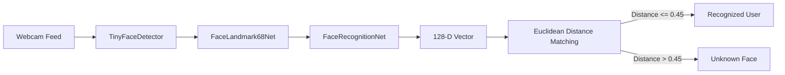

# 👤 Universal Client-Side Face Recognition & Registration Toolkit

> **100% Free & Zero-API-Cost** biometrics engine powered by **TensorFlow.js** and **face-api.js**.  
> Designed for drop-in integration into any Web App, SaaS, Dashboard, or Attendance/Security Kiosk (React, Next.js, Angular, Vue, Vanilla JS, Node.js, Electron).

---

## 📁 Repository & Folder Structure

```
D:\Projects\Face Recognition/
├── models/                               ← Pre-trained Neural Network weights (Local Assets)
│   ├── tiny_face_detector_model-*        ← Lightweight fast face bounding-box detector
│   ├── face_landmark_68_model-*          ← 68-point facial geometry landmark net
│   └── face_recognition_model-*          ← 128-dimensional embedding vector descriptor net
│
├── src/                                  ← Core SDK & TypeScript/JavaScript library
│   ├── types.ts                          ← Data contracts (FaceQuality, StoredRecord, etc.)
│   ├── face-engine.ts                    ← Main FaceEngine class with lifecycle methods
│   ├── storage-adapters.ts               ← Database connectors (LocalStorage, REST, Firebase, Supabase)
│   └── face-api.min.js                   ← Offline standalone runtime bundle
│
├── examples/                             ← Ready-to-run reference implementations
│   ├── vanilla-demo/                     ← Complete interactive HTML5/JS demo
│   │   ├── index.html                    ← Live UI with face scanner, quality meter & database
│   │   ├── app.js                        ← Controller logic
│   │   ├── style.css                     ← Clean dark-theme styles
│   │   └── models/                       ← Self-contained models folder
│   ├── react-demo/                       ← React Hook (`useFaceRecognition.ts`) & Component
│   └── angular-demo/                     ← Angular Standalone Component & Service
│
├── package.json                          ← Project manifest and dependencies
└── README.md                             ← Master documentation
```

---

## ⚡ Quickstart (Run Demo in 5 Seconds)

The `examples/vanilla-demo/` folder is completely standalone and works right away:

```bash
cd "D:\Projects\Face Recognition"
npx serve examples/vanilla-demo -p 3000
```
Open **`http://localhost:3000`** in your browser. Allow camera permission, and you can immediately:
1. Register a face with quality detection.
2. Test live recognition in real-time.
3. Manage registered biometrics stored in local storage.

---

## 🧠 How the AI Recognition Pipeline Works



1. **Detection (`TinyFaceDetector`)**: Fast SSD MobileNet V1 variant that identifies the location of a human face in the camera frame.
2. **Landmarking (`FaceLandmark68Net`)**: Maps 68 topological points (eyes, nose bridge, jawline contours).
3. **Feature Vector Extraction (`FaceRecognitionNet`)**: Computes a unique **128-dimensional floating point array** (biometric embedding).
4. **Matching (`FaceMatcher`)**: Calculates the Euclidean distance between the live vector and registered vectors:
   - **Distance $\le 0.45$**: Confirmed match ($\approx 60\% - 99\%$ confidence).
   - **Distance $> 0.45$**: Unrecognized / Unknown person.

---

## 💾 Where Biometric Data is Stored & Privacy

> ⚠️ **Privacy Best Practice**: You do **NOT** need to store raw photos of users. You only store the **128-number mathematical vector** (`[0.124, -0.056, 0.281, ...]`).

### Database Storage Options

#### 1. LocalStorage / IndexedDB (Client-side / Offline)
```typescript
localStorage.setItem('face_db', JSON.stringify([
  { label: 'user_123', descriptors: [[0.12, -0.05, 0.28, ...]] }
]));
```

#### 2. PostgreSQL / Supabase
```sql
CREATE TABLE registered_faces (
  id UUID PRIMARY KEY DEFAULT gen_random_uuid(),
  user_id TEXT NOT NULL UNIQUE,
  display_name TEXT,
  descriptors JSONB NOT NULL,
  created_at TIMESTAMPTZ DEFAULT NOW()
);
```

#### 3. Firebase Firestore
```typescript
import { doc, setDoc } from 'firebase/firestore';

await setDoc(doc(firestore, 'registered_faces', employeeId), {
  employeeId,
  displayName: 'John Doe',
  descriptors: descriptorsArray, // Array of 128-number arrays
  updatedAt: new Date().toISOString()
});
```

#### 4. MongoDB
```json
{
  "_id": "66ce78f...",
  "userId": "EMP_102",
  "displayName": "Sarah Connor",
  "descriptors": [
    [0.082, -0.194, 0.041, 0.129, ...]
  ]
}
```

---

## 🛠️ Step-by-Step Integration in Your Own App

### Step 1: Copy Models
Copy the `models/` folder from this directory into your app's public assets folder:
- **Next.js / React (Vite)**: `public/models/`
- **Angular**: `src/assets/models/`
- **Vue / Nuxt**: `public/models/`

### Step 2: Install Dependency
```bash
npm install face-api.js
```

### Step 3: Initialize Engine & Register Face
```typescript
import { FaceEngine } from './src/face-engine';

const engine = new FaceEngine({ matchThreshold: 0.45 });

// 1. Load models
await engine.loadModels('/models');

// 2. Start webcam
const videoEl = document.getElementById('my-video') as HTMLVideoElement;
await engine.startCamera(videoEl);

// 3. Capture face descriptor on button click
const descriptor = await engine.extractDescriptor(videoEl);
if (descriptor) {
  const record = engine.registerFace('EMP_001', [descriptor], 'John Doe');
  
  // Save record to your backend or database
  await fetch('/api/save-face', {
    method: 'POST',
    headers: { 'Content-Type': 'application/json' },
    body: JSON.stringify(record)
  });
}
```

### Step 4: Live Recognition
```typescript
// Pass the live extracted vector into recognizeFace:
const result = engine.recognizeFace(liveDescriptor);

if (result.isMatch) {
  console.log(`Welcome back, ${result.displayName}! Confidence: ${Math.round(result.confidence * 100)}%`);
} else {
  console.warn('Unknown person');
}
```

---

## 💰 Cost & Licensing
- **AI Computing Cost**: **$0.00 (100% Free)**. Runs entirely on the user's browser/CPU/GPU.
- **License**: **MIT License** — Free to use in commercial, enterprise, or personal applications with zero restrictions.
